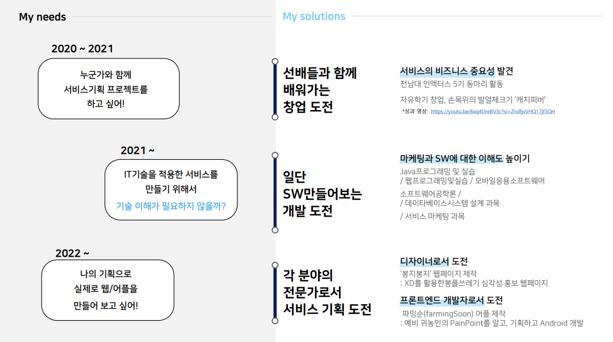

# test
test 요건 ~ 연습

## 🖐️ hello, 이은경 입니다

안녕하세요. 더 나은 서비스를 제공하고 싶은 예비 UX기획자입니다.  

   

### 🤓 지금까지 도전한 프로젝트  
. KIDS WITH ( 키윗 ) -워킹맘을 위한 아이 교육관리 서비스 기획  

. FarmingSoon ( 파밍순 ) -귀농체험 서비스로 나만의 귀농지 찾는 어플

. JNU봉플쓰레기 심각성 홍보 웹 페이지 - 전남대 봉플 쓰레기 심각성 알리는 웹
  
. 풋살장 예약 웹 페이지 - 광주 풋살장 예약 및 팀 경기 신청하는 웹

. 아프지망고 - chatGPT 활용한 영유아 어린이 복약지도 어플   

    
   

  

## 🚩 지금까지 저는 ~

   

## 🤔 궁금하신다면, 여기로 오세요!

[네이버 블로그] (https://blog.naver.com/luk0992)

